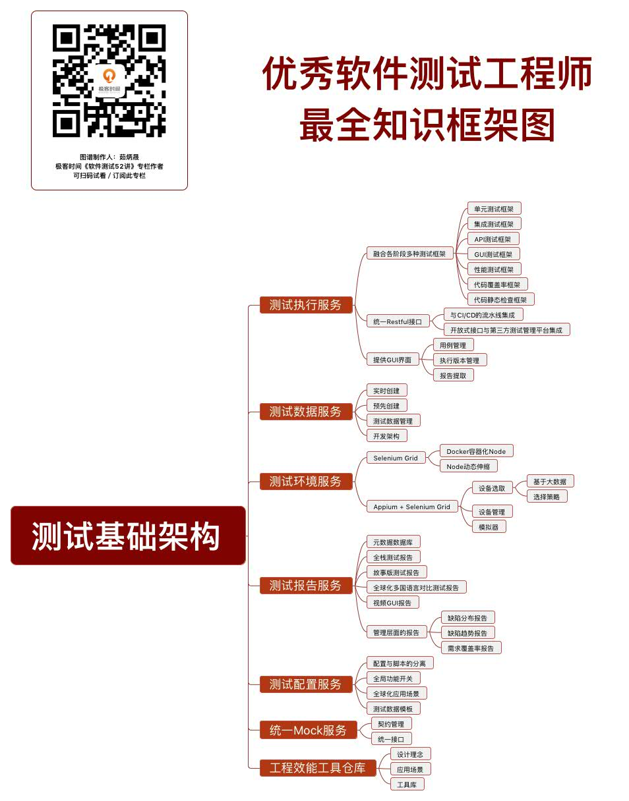

## 一、软件测试最全知识框架图-《软件测试52讲》茹炳晟

### 1 软件测试最全知识框架图谱

### 2 测试基础架构-《软件测试52讲》茹炳晟

### 3 性能测试-《软件测试52讲》茹炳

### 4 API测试-《软件测试52讲》茹炳晟

### 5 测试基础知识-《软件测试52讲》茹炳晟

### 6 GUI自动化测试-《软件测试52讲》茹炳晟

### 7 移动应用测试-《软件测试52讲》茹炳晟

### 8 其他基础知识与技能-《软件测试52讲》茹炳晟

## 二、陶辉出品：深入Nginx100讲脑图

## 三、王争出品：算法知识脑图

## 四、张磊出品：Kubernetes技能图谱高清

## 五、郑雨迪出品：JVM知识框架图

## 六、王一出品，AI基础课

### 1 AI基础课-机器学习

### 2 AI基础课-深度学习

### 3 AI基础课-数学基础

